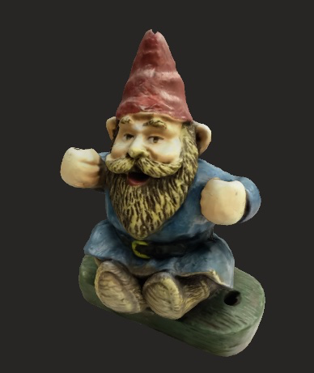
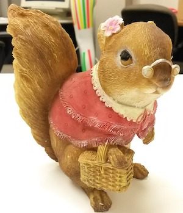
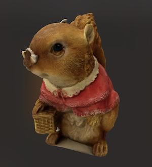
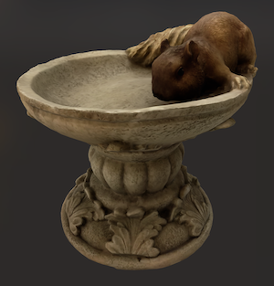
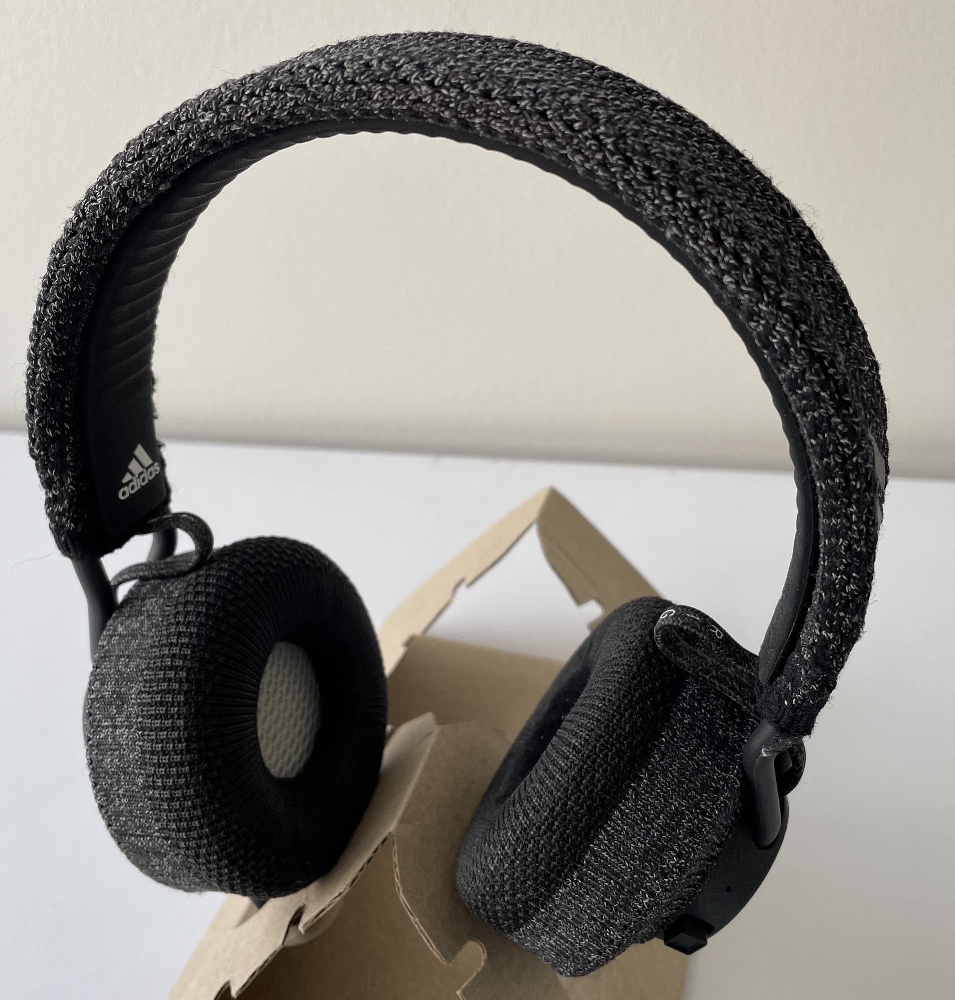
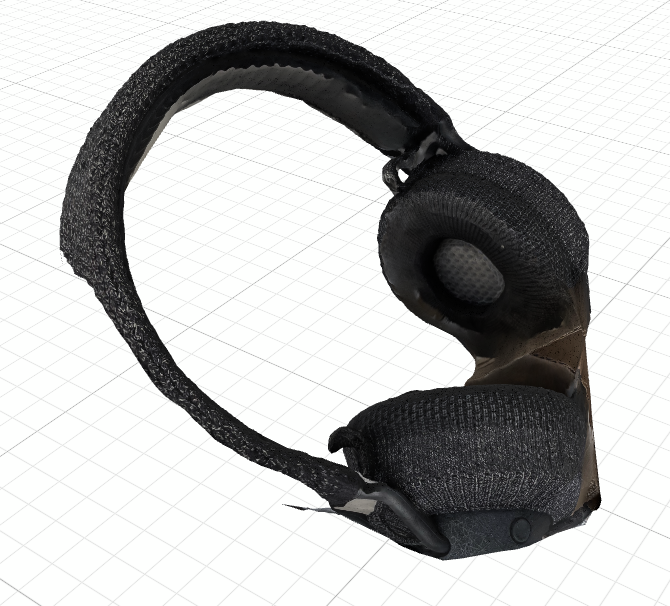

# Sayduck Photogrammetry

Sayduck's photogrametry proof of concept

## Run

How to compile the cli:

1. Launch the project in xcode
2. Archive the project
3. Drag Products -> SayduckPhotogrammetry to terminal window to get the compiled cli path
4. USAGE: hello-photogrammetry <input-folder> <output-filename> [--detail <detail>] [--sample-ordering <sample-ordering>] [--feature-sensitivity <feature-sensitivity>]

## Datasets

- Click on the input picture to open the input folder
- Click on the output picture to download the USDZ

| name              | entries | input                                                                              | output                                                                                     | source                                       | note              |
| ----------------- | ------- | ---------------------------------------------------------------------------------- | ------------------------------------------------------------------------------------------ | -------------------------------------------- | ----------------- |
| gargoyle          | 23      |                    |                    | Nicky                                        | Very poor quality |
| gnome             | 27      |                          |                          | [source](http://zhuoliang.me/meshrecon.html) |
| squirrel          | 23      |                    |                    | [source](http://zhuoliang.me/meshrecon.html) |
| teapot            | 26      |                        |                        | [source](http://zhuoliang.me/meshrecon.html) |
| woodland-squirrel | 20      |  |  | [source](http://zhuoliang.me/meshrecon.html) |
| zound             | 20      |                          |                          | Greg                                         |
