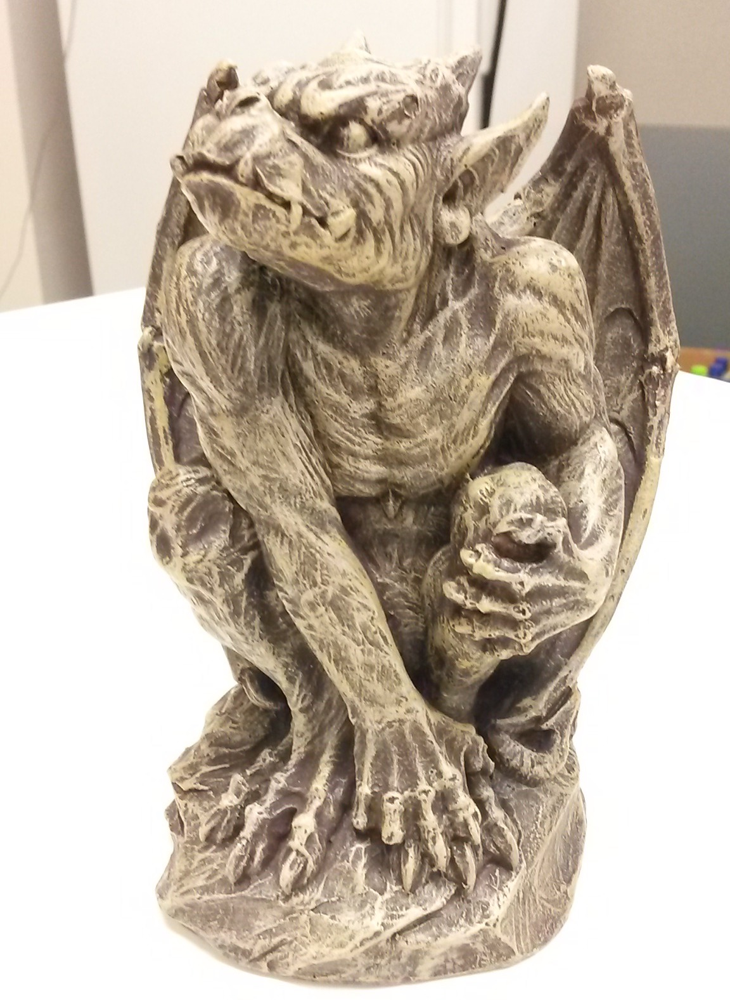
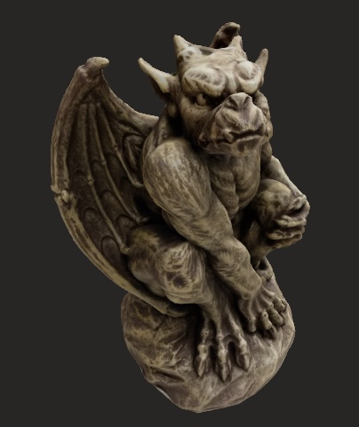
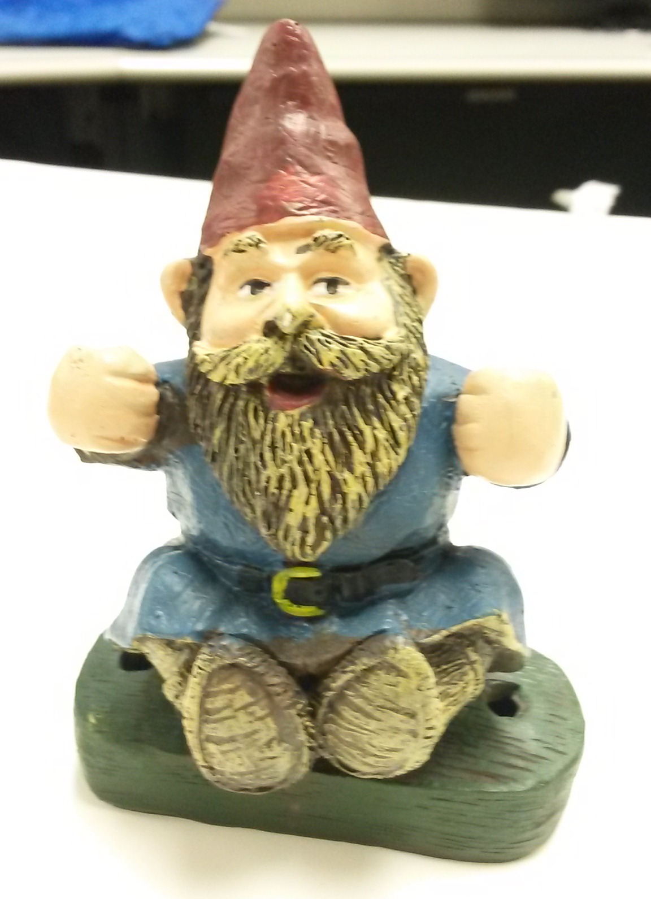
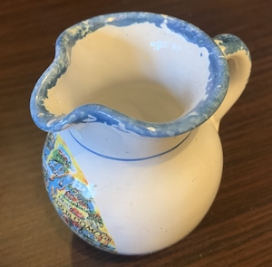
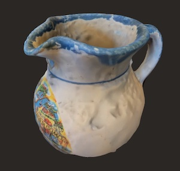
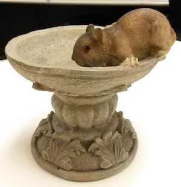
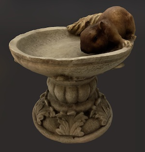

# Sayduck Photogrammetry

Sayduck's photogrametry proof of concept

## Run

How to compile the cli:

1. Launch the project in xcode
2. Archive the project
3. Drag Products -> SayduckPhotogrammetry to terminal window to get the compiled cli path
4. USAGE: hello-photogrammetry <input-folder> <output-filename> [--detail <detail>] [--sample-ordering <sample-ordering>] [--feature-sensitivity <feature-sensitivity>]

## Datasets

- Click on the input picture to open the input folder
- Click on the output picture to download the USDZ

| name              | # inputs | Input                                                                              | Output                                                                                     | Note                         |
| ----------------- | -------- | ---------------------------------------------------------------------------------- | ------------------------------------------------------------------------------------------ | ---------------------------- |
| Gargoyle          | 23       |                    |                    | Very very poor quality input |
| Gnome             | 27       |                          |                          |
| Teapot            | 26       |                        |                        |
| Woodland Squirrel | 20       |  |  |
